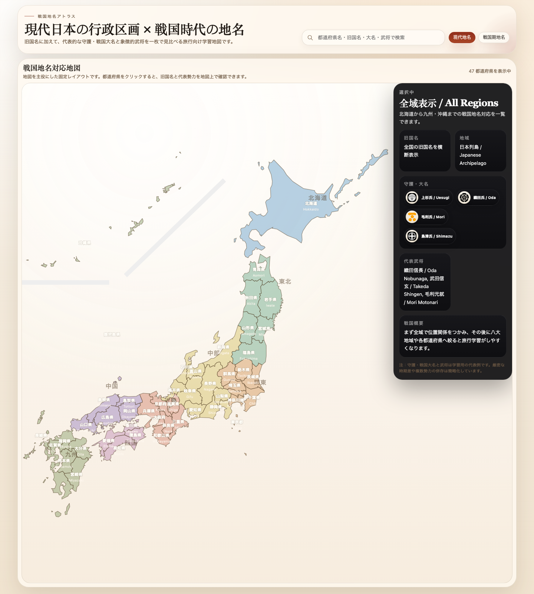

# Sengoku Codex

An interactive map that connects modern Japanese prefectures with Sengoku-period place names.

[Live Demo](https://sakagami-yoshitoshi.github.io/sengoku-codex/) · [Release v0.1.0](https://github.com/sakagami-yoshitoshi/sengoku-codex/releases/tag/v0.1.0) · [Source Code](./src/)

## What It Is

Sengoku Codex is a desktop-first static web map for learning how present-day Japanese prefectures relate to Sengoku-era provinces, regional powers, and notable historical figures.

It is designed for history-oriented travel planning and on-the-go reference, so you can quickly answer questions like: "Which modern prefecture am I in?" and "What was this area called during the Sengoku period?"

## Highlights

- Covers all 47 Japanese prefectures
- Displays modern names and Sengoku-era place names in Japanese and English
- Uses the modern eight-region color grouping in the default full-map view
- Switches to a zoomed local view when a prefecture is selected
- Shows major city labels inside the zoomed prefecture view
- Includes an information panel with provinces, regional grouping, daimyo, notable figures, and a short historical summary
- Uses a split `HTML + CSS + JavaScript` frontend structure for easier maintenance

## Live Access

- GitHub Pages:
  `https://sakagami-yoshitoshi.github.io/sengoku-codex/`

If the page has not refreshed yet, GitHub Pages is usually still deploying. Please check again in a few minutes.

## Repository Layout

- `src/`
  - Main source directory
  - `index.html` is the primary authoring entrypoint
  - `assets/app.css` contains shared styling
  - `assets/app.js` contains shared interaction logic
  - `japan-prefectures.svg` is the vector base map source
- `docs/`
  - GitHub Pages publishing directory
  - `assets/preview.png` is the repository preview image
- `outputs/`
  - Standalone exported delivery snapshot
- `.github/workflows/`
  - GitHub Pages deployment workflow

## Local Use

Open either of the following files in a browser:

- `src/index.html`
- `outputs/japan-sengoku-map.html`

## Current Release

Current public release:

- `v0.1.0`

Release details:

- [CHANGELOG.md](./CHANGELOG.md)
- [GitHub Release v0.1.0](https://github.com/sakagami-yoshitoshi/sengoku-codex/releases/tag/v0.1.0)

## Documentation Policy

- Repository documentation is maintained in English.
- The application interface itself remains in Japanese, with bilingual historical and modern place-name labels where implemented.

## License

- [MIT](./LICENSE)
